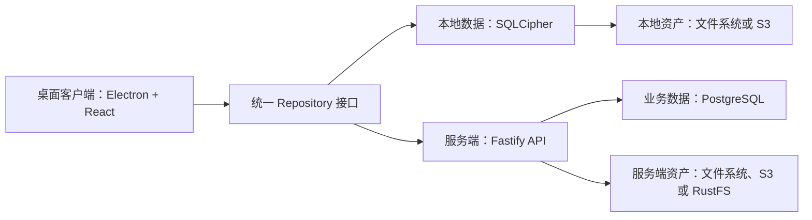

<div align="center">
  

  <h1>Deek PM</h1>

  <p><strong>把项目、知识、密码与附件，放进一个真正属于你的工作空间。</strong></p>
  <p>本地优先 · 端到端资产管理 · 可选自部署</p>

  <p>
    <a href="https://github.com/deek-coder/deek-pm/actions/workflows/ci.yml"></a>
    <a href="https://github.com/deek-coder/deek-pm/releases"></a>
    <a href="LICENSE"></a>
    
  </p>

  <p>
    <a href="#核心能力">核心能力</a> ·
    <a href="#快速开始">快速开始</a> ·
    <a href="#系统架构">系统架构</a> ·
    <a href="#数据与存储">数据与存储</a> ·
    <a href="CONTRIBUTING.md">参与贡献</a>
  </p>
</div>

---

Deek PM 是一个面向个人与小团队的桌面知识工作台。它既可以完全离线运行，也可以连接自部署服务，在不同设备之间共享统一的数据与资产存储。

正文、图片和附件不再各自为政：数据库只保存内容、元数据和引用关系，文件本体统一进入 Asset 仓储，并可落在本地目录、服务器文件系统或 S3 兼容对象存储中。

> [!IMPORTANT]
> `v0.1.0` 是首个开源预览版本，适合个人使用和自部署体验。重要数据请同时备份数据库、环境配置与资产目录。

## 核心能力

| 能力 | 说明 |
| --- | --- |
| 🗂️ 项目知识库 | 项目、分组、层级页面、富文本、代码块、链接、密码条目和附件 |
| 🔒 本地加密 | 本地模式使用 SQLCipher，数据库密钥由系统安全存储或主密码保护 |
| 🖼️ 统一资产 | 正文图片与附件统一登记，支持 SHA-256 去重、引用追踪和旧数据迁移 |
| ☁️ 灵活存储 | 本地目录、服务端文件系统、S3 及 RustFS 使用统一存储接口 |
| 🧳 备份迁移 | 支持本地加密备份、恢复，以及本地工作空间迁移到服务端 |
| 🚀 自部署 | 首次安装向导自动创建管理员、工作空间和默认存储，Docker Compose 一键启动 |

## 快速开始

运行源码需要 Node.js `22.12+` 和 npm。

### 启动桌面客户端

```bash
git clone https://github.com/deek-coder/deek-pm.git
cd deek-pm/app
npm ci
npm run dev
```

### Docker 自部署

进入部署目录并生成安全配置：

```powershell
# Windows
cd deploy/docker
.\init.ps1
docker compose up -d --build
```

```bash
# Linux / macOS
cd deploy/docker
chmod +x init.sh
./init.sh
docker compose up -d --build
```

服务启动后，在客户端选择“自部署服务”并填写 API 地址。新实例会自动显示首次安装向导。端口、数据卷、RustFS 和生产备份策略见 [Docker 部署文档](deploy/docker/README.md)。

### 常用开发命令

```bash
# app/
npm run lint
npm run test:local
npm run test:migration
npm run build
npm run dist:win

# server/
npm test
npm run build
npm run db:migrate
```

## 系统架构



| 目录 | 技术栈 | 主要职责 |
| --- | --- | --- |
| [`app`](app) | Electron、React、TypeScript、BlockNote | 桌面 UI、本地加密数据库、资产、备份与迁移 |
| [`server`](server) | Node.js、Fastify、PostgreSQL | 鉴权、业务 API、资产生命周期与存储适配 |
| [`deploy/docker`](deploy/docker) | Docker Compose、PostgreSQL、RustFS | 自部署编排与初始化配置 |

更详细的边界和技术取舍见 [系统架构](.agents/architecture/system-overview.md) 与 [技术决策](.agents/architecture/tech-decisions.md)。

## 数据与存储

```text
数据库：正文、条目元数据、资产索引、引用关系
文件存储：图片与附件的二进制内容
备份范围：数据库 + 环境配置 + 资产目录 / S3 Bucket
```

- 本地模式可以仅使用本机，也可以为资产配置 S3 兼容存储。
- 服务端可以使用挂载目录、S3 或 RustFS，业务层不依赖具体供应商。
- 本地备份会内嵌适合大小的资产；单文件超过 16 MB 或资产总量超过 64 MB 时，需要同时备份物理资产目录。
- 自部署环境必须备份 PostgreSQL、`.env` 和资产存储；`DATA_ENCRYPTION_KEY` 丢失后无法恢复敏感字段。

## 开发与发布

- 稳定分支：`main`
- 功能分支：`feature/<name>`
- 修复分支：`fix/<name>`
- 发布分支：`release/<version>`
- 提交信息遵循 Conventional Commits，例如 `feat(server): 增加首次安装接口`
- 版本遵循 Semantic Versioning，发布标签格式为 `vX.Y.Z`

请先阅读 [贡献指南](CONTRIBUTING.md)、[行为准则](CODE_OF_CONDUCT.md) 和 [安全策略](SECURITY.md)。版本变化记录在 [CHANGELOG.md](CHANGELOG.md)。

## 当前状态

- Windows 安装包与便携版构建已配置。
- 客户端 lint、本地仓库测试、迁移测试和生产构建已接入 CI。
- 服务端迁移、资产生命周期、存储适配和首次安装流程均有自动化测试。
- 当前重点是完善跨平台打包、恢复演练、可观测性与大资产传输体验。

## 许可证

Deek PM 基于 [Apache License 2.0](LICENSE) 开源。

<div align="center">
  <sub>Built with care for local-first knowledge.</sub>
</div>
