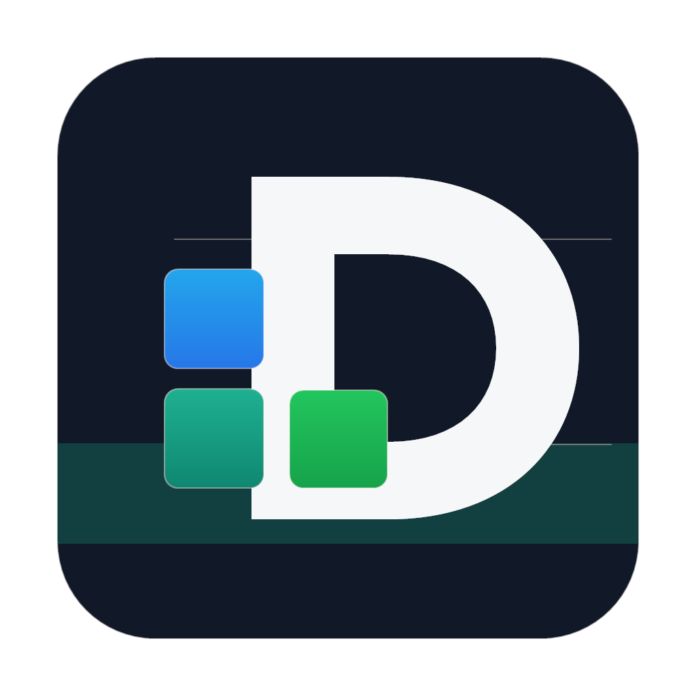
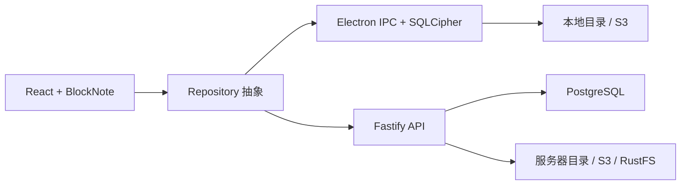

# Deek PM



[](https://github.com/deek-coder/deek-pm/actions/workflows/ci.yml)
[](LICENSE)
[](https://github.com/deek-coder/deek-pm/releases)

Deek PM 是一个面向个人资料管理的桌面应用。它可以完全离线运行，也可以连接官方或自部署服务；正文图片与托管附件统一通过 Asset 模型管理，物理文件支持本地目录和 S3 兼容存储。

> 当前版本：`v0.1.0`。适合个人自用和自部署预览，不建议在没有独立备份与恢复演练的情况下作为唯一数据源。

## 功能

- Electron 桌面客户端，支持项目、分组、层级页面、富文本、密码条目、链接和附件。
- 本地模式使用 SQLCipher，加密数据库密钥可由系统安全存储或主密码保护。
- 正文图片与托管附件统一登记为 Asset，支持 SHA-256 去重和引用追踪。
- 本地文件系统与 S3/RustFS 使用同一存储接口，可校验后安全切换。
- 服务端使用 PostgreSQL、JWT、AES-256-GCM，并提供文件系统/S3 双存储。
- 自部署实例提供一次性安装向导，创建首个管理员、工作空间和文件存储。
- 本地加密备份、恢复，以及本地资料迁移到服务端。
- Windows 安装包和便携版构建配置。

## 架构



| 模块 | 技术 | 职责 |
| --- | --- | --- |
| `app` | Electron、React、TypeScript、BlockNote | 桌面 UI、本地加密库、本地资产与备份 |
| `server` | Node.js、Fastify、PostgreSQL | 登录鉴权、业务 API、服务端资产生命周期 |
| `deploy/docker` | Docker Compose | PostgreSQL、API、RustFS 一键自部署 |

设计文档见 [系统架构](.agents/architecture/system-overview.md) 和 [技术决策](.agents/architecture/tech-decisions.md)。

## 快速开始

要求 Node.js `22.12+` 和 npm。

### 桌面客户端

```bash
cd app
npm ci
npm run dev
```

常用命令：

```bash
npm run lint
npm run test:local
npm run test:migration
npm run build
npm run dist:win
```

### Docker 自部署

Windows：

```powershell
cd deploy/docker
.\init.ps1
docker compose up -d --build
```

Linux/macOS：

```bash
cd deploy/docker
chmod +x init.sh
./init.sh
docker compose up -d --build
```

服务启动后，在桌面客户端选择“自部署服务”，填写 API 地址。新实例会自动进入首次安装向导。完整说明见 [Docker 部署文档](deploy/docker/README.md)。

### 服务端开发

```bash
cd server
cp .env.example .env
npm ci
npm run db:migrate
npm run dev
```

更多配置见 [服务端文档](server/README.md) 和 [客户端文档](app/README.md)。

## 数据与备份

- 数据库负责正文、元数据和引用关系；图片与附件本体存放在文件系统或 S3。
- 本地备份会内嵌适合大小的资产；单文件超过 16 MB 或总资产超过 64 MB 时需要同时备份物理资产目录。
- 自部署生产环境必须单独备份 PostgreSQL、`.env` 和资产存储。
- `DATA_ENCRYPTION_KEY` 丢失后无法解密服务端敏感字段。

## 开发与发布

- 稳定分支：`main`
- 功能分支：`feature/<name>`
- 修复分支：`fix/<name>`
- 发布分支：`release/<version>` 或自动化环境使用 `codex/release-<version>`
- 提交信息遵循 Conventional Commits，例如：`feat(server): 增加首次安装接口`
- 版本遵循 Semantic Versioning，发布标签格式为 `vX.Y.Z`

详细流程见 [贡献指南](CONTRIBUTING.md) 和 [变更日志](CHANGELOG.md)。

## 安全

请不要在公开 Issue 中披露漏洞、密钥或数据库内容。报告方式见 [安全策略](SECURITY.md)。

## 许可证

[Apache-2.0](LICENSE) © 2026 Deek PM contributors
